## LLM Auto Eval

> 主要 focus 在 automate generate evaluation queries 上边

### Automatic generate complex questions

[CHASE: How to Get Your LLM to Generate Challenging Problems for Evaluation](https://arxiv.org/pdf/2502.14678) [codebase](https://github.com/McGill-NLP/CHASE) [2502, arixv, Arkil Patel, Mila and McGill, Canada CIFAR]

用 build up hard problem with simple components 的方法逐渐构造一个困难的问题来测试 LLM

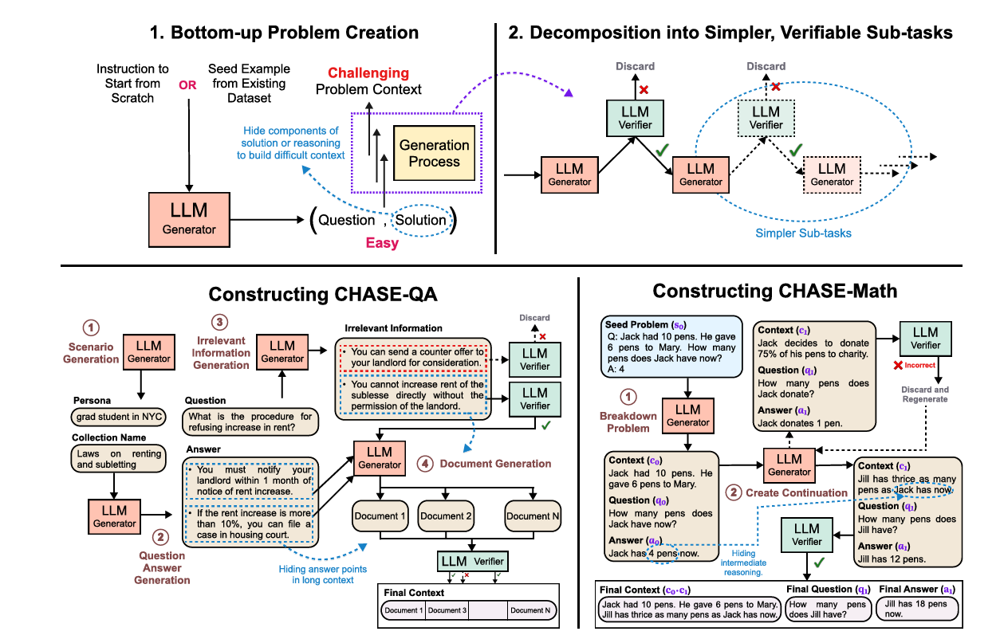

每一个 simple component 都要能够简单到 LLM verifier 能够判断出来是否正确。

automatic 生成问题的方式值得注意一下，我们记录以下 CHASE QA 的问题生成方式。本质上他们在做的事情是先知道答案，再根据答案生成问题，然后在问题中混入一些无关的信息，让问题变成更长的 document

1. Generate diverse scenarios
2. Generate QA pairs
3. Generate irrelevant information
4. Generate document

Evaluation 的方式仍然是 LLM as a Judge

对于 CHASE code 而言，他们首先生成了很多 python help functions。然后从这些 help functions 里边选一些出来作为 answer，构造一个 algorithm 的需求。第三步是根据 answer code 生成 test python code，如果 answer code 能够 pass test function 的话，就 discard answer code，然后用 test functions 测试 LLM 能不能正确解决这个问题

[MuSR: Testing the Limits of Chain-of-thought with Multistep Soft Reasoning](https://arxiv.org/pdf/2310.16049) [codebase](https://github.com/Zayne-Sprague/MuSR) [2310, ICLR 2024, Zayne Sprague, Xi Ye, Greg Durrett, UT Austin]

这个 work 用了两步来构建 synthetic data，第一步是用 neuralsymbol 来提取 fact，第二步是根据这个 fact 生成 narrative。

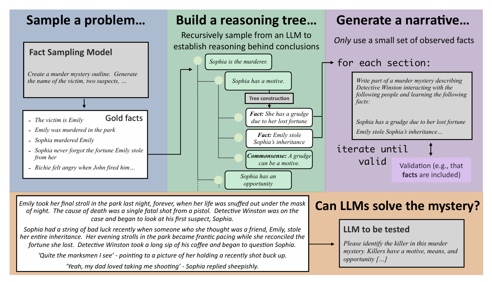

看起来这里 neuralsymbolic 的意思是构造一个 reasoning tree

这里他们主要涉及了三种任务

1. muder mysterious：根据一个 narrative 的方式找到凶手
2. object placements：用 narrative 的方式描述一群人在搬东西的场景，问最后东西都在哪里
3. team allocation：有一群人和一堆任务，怎么样给这群人分配这些任务能够让整个系统最 optimal

[AutoLogi: Automated Generation of Logic Puzzles for Evaluating Reasoning Abilities of Large Language Models](https://arxiv.org/pdf/2502.16906?) [codebase](https://github.com/8188zq/AutoLogi) [2502, arxiv, Qin Zhu, Junyang Lin, Qwen, Fudan]

自动生成 logic problem 来 test LLM model。但是这个工作感觉主要解决的问题是，multi choice reasoning dataset 可以被模型猜正确答案。他们主要想避免让模型猜正确答案，用 verifier 验证每一个步骤

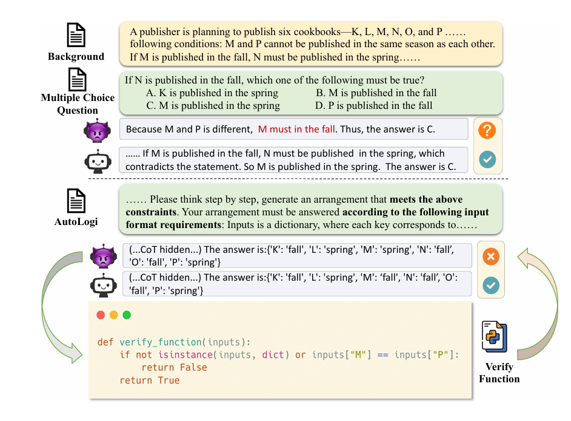

看起来他们的方法需要 base on 一些 verify function 才行。他们工作的好处还在于能够生成 controllable complexity 的 questions，用这些东西可以更好帮模型训练

通过 program based 的 verifier，来验证 LLM 的 answer 是否正确。通过增加或者减少 constraints 的数量，来控制推理的 complexity 

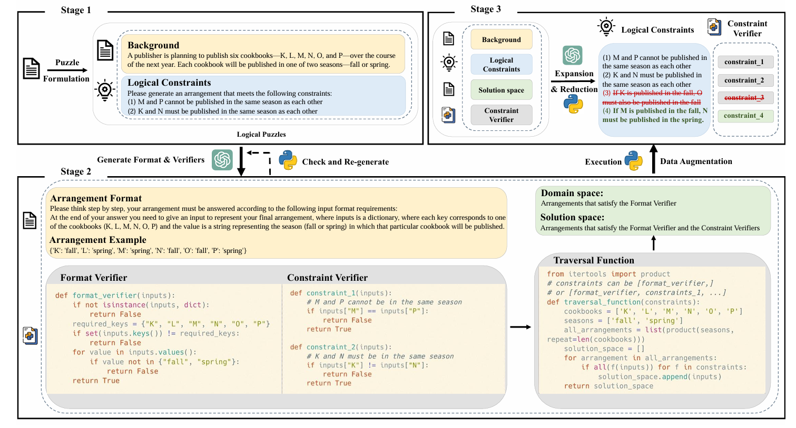

本质上这个工作是基于以前的 multiple choice dataset  extend 过来的。所以 data collection 对他们来说并不是一个困难

### Math

[Math Perturb](https://arxiv.org/pdf/2502.06453) [2502, arixv, Kaixuan Huang, Mengdi Wang, Princeton]

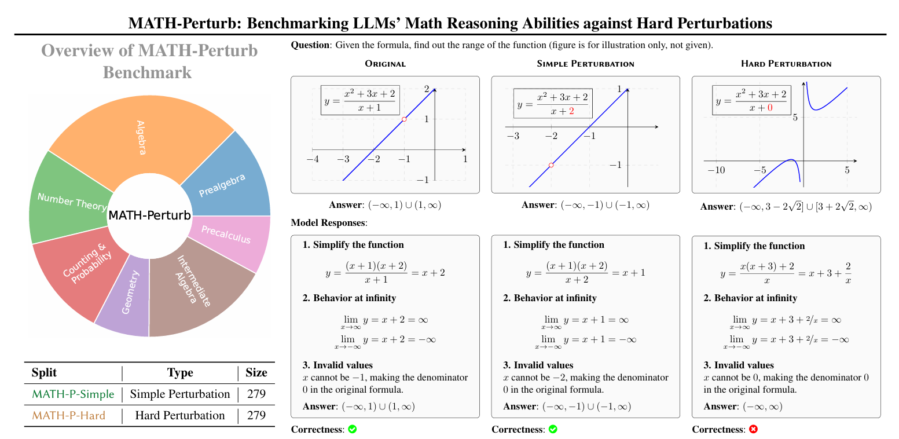

通过给原有的 math problem 做 perturbation 来增加难度，本质上是一种 extendable Evaluation 的手段。很好奇他们是怎么做 perturbation 以及 perturbation 之后的 verification 的

他们的 perturbation 完全是人工做的。perturb 之后的 quality control 是用 GPT o1 mini 过了一遍，和 human 的答案不同的，再去人工核查。所以总共这些 pair 只有 279 个

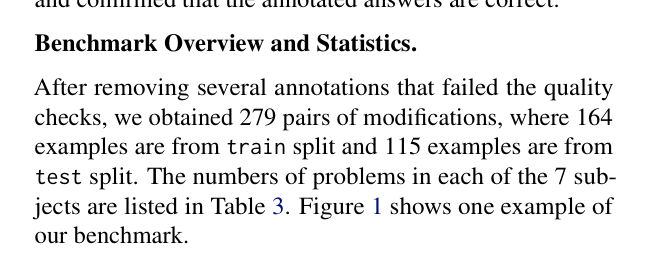

这个工作的 contribution 是 labor intensive 的 math perturbation。构造了一个后人可以用来提升的 benchmark。里边 automatic evaluation 的部分并不多

[Math Square](https://arxiv.org/pdf/2407.21009) [2407, NeurIPS Math AI Workshop 2024, Vedant Shah, Anirudh Goyal, Mila]

这个工作是通过 AI 构造更难的 math problem。感觉 math questions construction 这个 direction 已经被做的很多了

这个 paper 的核心思想是从原始的 math dataset 里边抽取出很多不同的 skill，根据这些 skill 进行排列组合。从而产生更难的 math 问题。这里 skill 的抽取，问题的构建，以及 verification 是几个比较重要的点可以看一下。

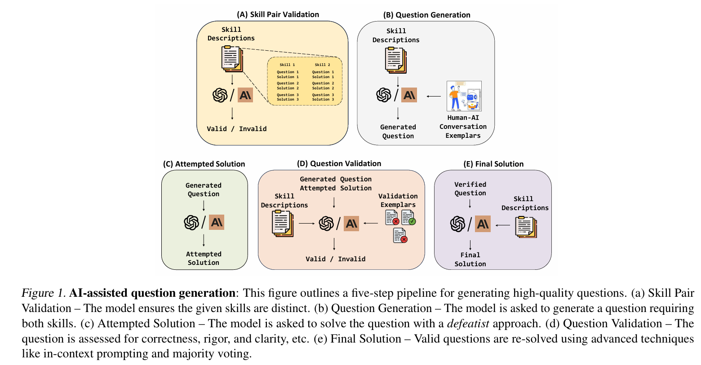

从他们的示意图上来看，好像整个过程都是 AI in AI's loop

第一步的 skill extraction 他们是基于[这个工作](https://arxiv.org/pdf/2405.12205) 做的。现在是直接有了 skills 和 questions 的 links。

在此之后，经过了 5 个步骤生成 math square 的 dataset

1. Skill pair validation：对 skill set 进行去重
2. Questions generation：这里就比较 tricky 了。作者声明他们生成的 questions 是需要 single final result，还要有 approximated answer。不太懂这里具体怎么搞的
3. Solution attempt：这一步应该是去 evaluate model 在 hard math problem 上的能力了
4. Questions validation 将 questions 和 attempted solutions 给 LLM，让它根据 given 的 critria 再进行一次评估
5. Final solution and re evaluation：让 LLM 再做一遍 solution，然后给 human screening

整体上来看还是一个 labor intensive 的 pipeline。dataset 里边的总共数量是 210。大部分的 data 都是被 human annotator 重新改过的

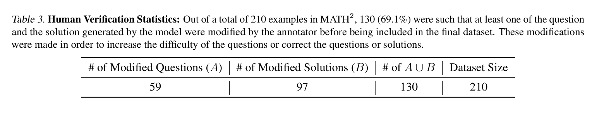

### RuozhiBench

[Ruozhi Bench](https://arxiv.org/pdf/2502.13125v1) [codebase](https://github.com/LibrAIResearch/ruozhibench) [2502, arxiv, Zenan Zhai, Haonan Li, LibrAI MBZUAI] 

在一些故意的 misleading questions 上 LLM 的能力。[原始的弱智吧 codebase](https://github.com/Leymore/ruozhiba)

他们出了生成 tricky questions，还生成了这些 tricky questions 对应的 normal 版本。这样的话能够更好地对比模型在 tricky questions 和 normal questions 上边表现的差距

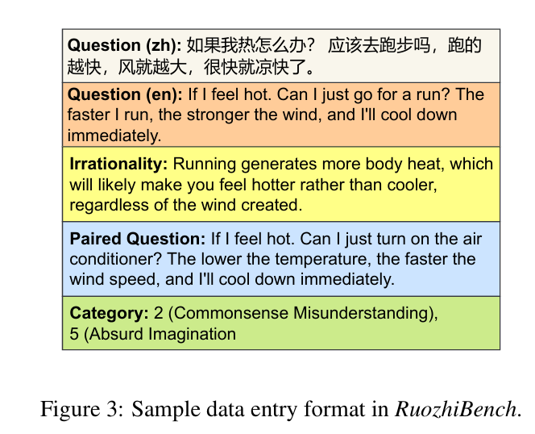

Evaluation 用的是 LLM as a Judge 的 framework。但是他们发现作为 evaluator 的模型本身有时候也很难发现 subtle 的 logic fallacy。所以他们构造了一个 Multi-Choice 版本的 ruozhi benchmark

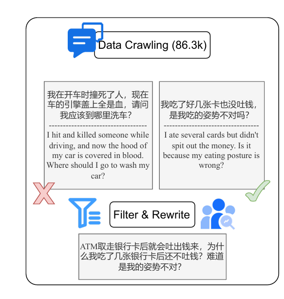

### Others

[Skills-in-Context: Unlocking Compositionality in Large Language Models](https://arxiv.org/pdf/2308.00304) [2308, arxiv,  Jiaao Chen, Jianshu Chen, Tencent AI Lab Seattle]

对 LLM 做不同能力组合的测试

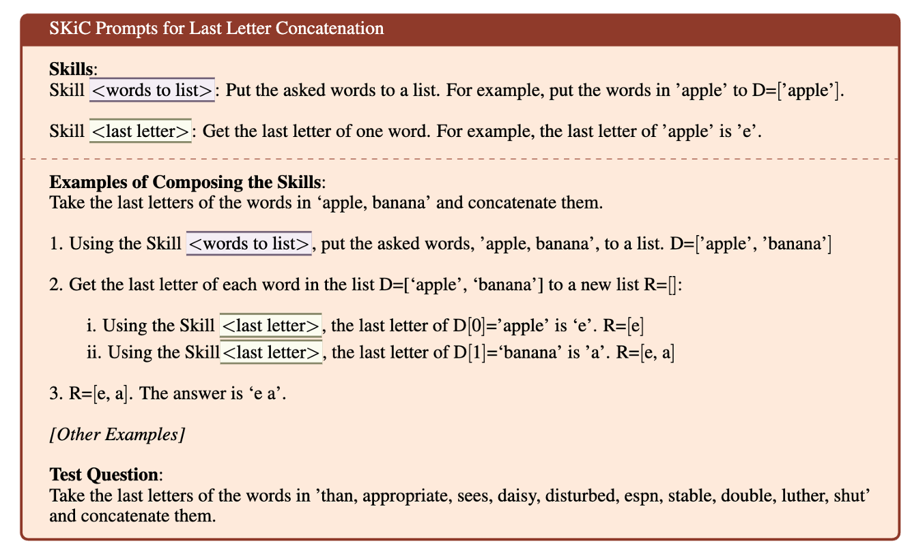

但是这个测试看起来像是文字游戏。

这个工作给出的解决方案是将这些 skill 放到 context 里边，claim 这样能够更好地帮助 LLM 解决 complex 的问题。但是我觉得唯一好玩的地方是他们的这个文字游戏，提出了一种有趣的测试 LLM 能力的方法。

