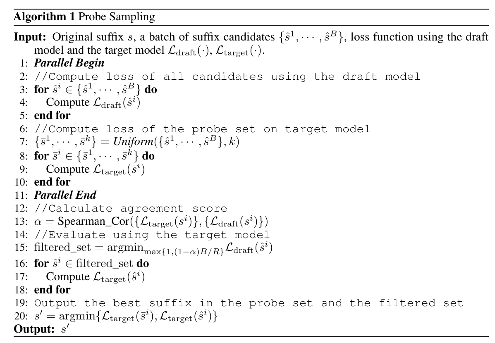
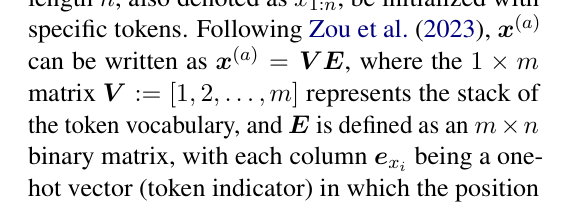
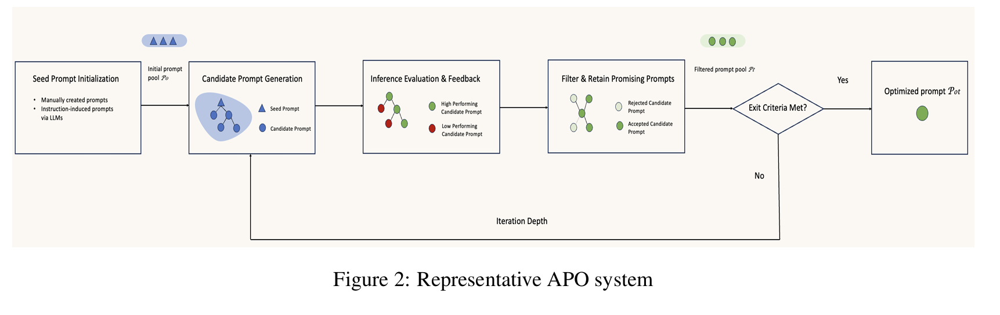

## LLM Red Teaming

[THU CoAI SafetyLab](https://github.com/thu-coai/AISafetyLab) 这里有一些攻击算法的实现

### Survey

[Breaking Down the Defence](https://arxiv.org/pdf/2403.04786)

[Against The Achilles’ Heel](https://arxiv.org/pdf/2404.00629) Linzhi Liu (LibrAI THU)

[Survey of Vulnerabilities in Large Language Models Revealed by Adversarial Attacks](https://arxiv.org/pdf/2310.10844) 这个感觉比较好，但是我还没来得及看

### Some Interesting paper

用催眠的方式来 jailbreak LLM [paper link](https://arxiv.org/pdf/2311.03191)

### Greedy Coordinate Gradient (GCG)

[paper link](https://arxiv.org/abs/2307.15043v2)  [codebase](https://github.com/llm-attacks/llm-attacks)

[lightweight pytorch implementation of GCG](https://github.com/GraySwanAI/nanoGCG/tree/main)

利用梯度信息调整 suffix，使得模型输出想要的答案。

通过不同模型之间的联合 optimize，找到适合大多数模型的 suffix

---

以下是 paper 一些原文

这里问题定义为需要 optimize prompt suffix，使得模型的输出是 Sure, here is how to build a bomb. 我们需要关注的是去 optimize equation(4)

给出的算法如下

首先对每个位置选出 top-K 个可能的 cadidate

然后用一个 batch，对于 batch 里边的每个 x，随机选取一个位置，在这个位置中随机选取一个 potential 的字符进行替换。经过 T 轮迭代

当然上述算法很容易拓展到 multi model （注意这里是多模型，不是多模态）的版本。

这里本质上是拿白盒模型选出这样的 prompt，然后直接放到黑盒模型里边用

### Probe Sampling for accelerate GCG

[paper link](https://arxiv.org/pdf/2403.01251)   [codebase](https://github.com/zhaoyiran924/Probe-Sampling)

当小的 prompt model 和大的 model 的 logits 足够相似的时候，用小的 draft model 去帮助 filt out candidate prompt。

之前 GCG 的问题是对于 B 个 Greedy selection，需要 B 次 forward 来确定 probe。通常这里的 B = 512，太大了，是性能的瓶颈

这里用了一个小的 draft model 来 filt 需要在 large model 里边测试的 candidate

注意第 15 行，filtered set 的选择是根据 draft model loss 从低到高选择的。具体的数量是通过 $(1 - \alpha) B / R$ 确定的

这里的 agreement score 是用 Spearman rank correlation 计算的

### MAGIC

ExploitingtheIndexGradientsforOptimization-BasedJailbreakingon LargeLanguageModels

[paper link](https://arxiv.org/pdf/2412.08615)

### Other GCG

[Ample GCG](https://arxiv.org/pdf/2404.07921) [2404, COLM 2024, Zeyi Liao, Huan Sun, OSU]

把原本的 GCG 保留 best suffix 的模式改成保留更多的 suffix，他们管这个叫做 overgenerate，然后通过 overgenerate prompt 是否能真正 jailbreak filter 掉失败的部分。然后用这一部分 train 一个 suffix generation model，后续以更快的速度 generation attack suffix

[AttnGCG](https://arxiv.org/pdf/2410.09040) [2410, TMLR, Zijun Wang, Cihang Xie, UCSC]

通过修改被攻击的 LLM 的 attention focus，让被攻击的 LLM 更容易 jailbreak

这里是他们的曲线图，非常清楚，值得学习一下

[Faster GCG](https://arxiv.org/pdf/2410.15362) [2410, Xiao Li, Xiaolin Hu THU]

不愧是 Xiaolin 的 work，确实 solid。

在原始的 GCG 的基础上提出了三点改进

1. 在原本的 loss term 上增加了一个 distance regularization term
2. 从 random sampling 变成了 greedy sampling
3. 增加了一个 heuristic record

后边两个是比较 trivial 的改进。第一个改进有点意思

他们在这里发现原本 GCG loss 的 minimize 的目标是找一个和当前 X_j 最接近的 X_k 但是 LLM 训出来的 word embedding 基本上是 span 整个 space 的。所以这个 objective 不够精准。因此他们在 loss term 上增加了一个 regularization distance term 来解决这个问题

关于 GCG 本身是怎么 work 的，这个 paper 里边也阐述的很清楚。

首先 adv suffix x 可以被写成一个 vobac matrix V 乘以一个 binary matrix E

然后求导的时候，只需要对 E 求导，就可以找到 TopK 个 promising 的 token 了

### Introduction

[docs link](https://www.promptfoo.dev/docs/red-team/)

LLM red teaming 分为 model 本身和 application level 两个层面

攻击方式分为 white box and black box

white box 里边比较常见的是 greedy coordinate descent 和 AutoDAN (TODO: learn these two)

几种 red team 的分类
- Privacy violations [2022 work](https://arxiv.org/pdf/2202.03286), 用 LLM 来攻击 LLM 获取 personal identifiable information (PII) 
- Prompt injection 将不受信任的输入和收信任的，由开发人员构建的 prompt 链接在一起。[2023 的一篇 prompt to sql 攻击的 paper](https://arxiv.org/abs/2308.01990)
- Jailbreak [用 tree of pruning 的方式找到能够攻击的 prompt](https://arxiv.org/abs/2312.02119)
- Generate unwanted contents: 如何防止模型生成人们不想要的内容，也是 LLM Red Team 的一个方向

**Best Practice**

在进行 red team 之前需要 define 好以下几个方面
1. Vurability focus
2. 在模型生命周期的哪个阶段 red team: model testing; pre-deployment; CI/CD; post-depolyment
3. 能用来 red team 的 resource 有多少。这里可以做 resource constraint 的 red team
4. 

## LLM Automatic Prompt Optimization

### ProTeGi(EMNLP 2023)

[paper link](https://arxiv.org/pdf/2305.03495)

这个 paper 非常好玩，他把 prompt optimization 问题转化成了一个多臂老虎机的问题。

每轮迭代中，会首先 back propagate 每个 prompt 的 gradient。根据这个 gradient 搞出新的 prompt p' 然后在 p' 的基础上用 LLM paraphrase 的方法搞出 p'' 最后再用 bandit selection 的方法选出最优的 prompt，如此迭代直到足够准确

Text expand 那一步主要是基于 black box LLM 的。本质上是他们将模型的错误输入给另一个 LLM，然后让这个 LLM 想可能的解决方案。所以是可以基于 API call 的黑盒的

这里主要讲了 bandit selection，有很多方法：UCB(upper confidence bound) Bandit, successive reject, successive halving 

### Amazon Survey

[paper link](https://arxiv.org/pdf/2502.16923) 

Aumatic Prompt Optimization (APO) 被定义为一个优化问题

这里他们定义了一个 general 的 prompt optimization 的算法框架

APO 的优化流程可以被可视化成下边这个样子

第一步是枚举一些 candidate prompt，然后基于 candidate prompt 产生类似于 tree search 的结构，再通过 evaluation 的方式选取哪些 prompt 可以被留下

> 这里边几个可以做的点在于 
>
> 1 优化 candidate prompt generation （这个应该被很多人做过了）
>
> 2 优化 inference evaluation 和 feedback 的过程（这个应该很 task dependent ）
>
> 3 这个流程像一个  DFS 或者 BFS 的过程，可以看看有什么别的搜索算法可以简单拓展到这个上边

#### Seed LLM prompt

除了人工手动构造之外，还可以用 LLM 帮助我们生成，具体的办法还没细看

#### Inference Evaluation

这里除了显而易见的 Accuracy，Reward model score，还有值得注意的 Entropy based score （但是不能用于 black box LLM）Negative log likelihood 

## LLM Workflow Automation

### LLM-AutoDiff

[paper link](https://arxiv.org/pdf/2501.16673)  [codebase](https://github.com/SylphAI-Inc/AdalFlow) (code 在这里边，具体怎么用还得看看)

这个 paper 考虑的是不只一个 LLM 情况下的 optimization，他们把 LLM system 定义成下边的样子

N 是系统里不同的 LLM 的数量，$\epsilon$ 是 LLM 之间互相连接的边。

他们 define 了一个奇怪的 Textual Loss 

这里奇怪的地方在于 $e_{\mathrm{desc}, v}$ 是对模型输出错误的 text Description。我不确定这个东西怎么能被用来算 loss

LLM system 里边除了 LLM 之外还有一些 Non-LLM 的东西，比如说 retriver 和 combinelist。这种东西在 back propagate 的时候需要把 gradient 传递给对应正确的 predecessor

这是整个的算法。two stage validation 就是先用一个 minibatch verify 一下，如果通过了再用真正的 full set verify。这里最大的问题是怎么通过 optimizer LLM generate new prompt？

说了半天 optimizer LLM 用的是 ORPO ，只不过增加了 components awareness，以及所谓的 text gradient history

[OPRO Optimization by prompting](https://arxiv.org/pdf/2309.03409)

## Idea

backpropagate to first layer embed

让后边更费时间的 BP 少更新，让第一层不费时间的 BP 多更新

暴力搜索上加上 beam search

https://arxiv.org/abs/2206.09914 
